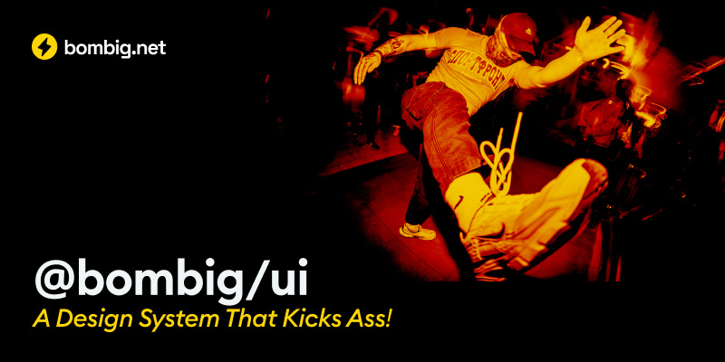

<div align="center">
  
  <br />
  <br />
  <h1>⚡ bombig/ui</h1>

[](https://www.npmjs.com/package/@bombig/ui)
[](https://bundlephobia.com/package/@bombig/ui)
[](https://www.npmjs.com/package/@bombig/ui)
[](LICENSE)
[](https://www.typescriptlang.org/)
[](https://reactjs.org/)
[](https://github.com/bombig-net/ui/actions/workflows/test.yml)
[](https://ui.bombig.net/coverage/)
[](https://ui.bombig.net)
[](https://github.com/prettier/prettier)
[](https://react-spectrum.adobe.com/react-aria/)
[](https://www.radix-ui.com/)
[](https://www.figma.com/)

Modern React component library powering all bombig.net websites and apps - crafted with ❤️ using React Aria, Radix UI, Tailwind CSS, and TypeScript.

[Documentation](https://ui.bombig.net) • [GitHub](https://github.com/bombig-net/ui) • [npm](https://www.npmjs.com/package/@bombig/ui) • [Coverage Report](https://ui.bombig.net/coverage/)

</div>

## ✨ Features

- 🎯 Built with React Aria and Radix UI primitives
- 🎨 Design tokens managed through Figma Tokens Studio
- 💅 All styles customizable via className prop
- ♿️ Accessible components out of the box
- 📦 Full TypeScript support with strict type checking
- 📱 Responsive by default
- 🚀 Optimized for rapid prototyping
- 🧪 Comprehensive test suite with Jest and Testing Library
- 🎭 Accessibility testing with jest-axe
- 📝 ESLint and Prettier integration for code quality

## 📦 Installation

```bash
# Using pnpm (recommended)
pnpm add @bombig/ui

# Using npm
npm install @bombig/ui

# Using yarn
yarn add @bombig/ui
```

## 💻 Usage

1. Import the CSS in your app's entry point (e.g., `app.tsx`, `_app.tsx`, or `main.tsx`):

```jsx
import '@bombig/ui/styles';
```

2. Use the components in your app:

```jsx
import { Button } from '@bombig/ui';

function App() {
    return <Button>Click me</Button>;
}
```

That's it! No additional configuration needed. The components will work out of the box with all the necessary styles and design tokens. All required fonts (Euclid Circular B and Geist Mono) are bundled with the package, so you don't need to manually import them.

## 📚 Documentation

Visit our [Storybook documentation](https://ui.bombig.net) to:

- Explore all components
- View live examples
- Read usage guidelines
- Try components interactively

## 🛠 Development

This is bombig.net's internal design system, crafted for our projects and rapid prototyping. While primarily for internal use, we maintain high code quality standards and welcome external usage.

```bash
# Install dependencies
pnpm install

# Start development
pnpm dev

# Run Storybook
pnpm storybook

# Run tests
pnpm test

# Run tests in watch mode
pnpm test:watch

# Run tests with coverage
pnpm test:coverage

# Type check
pnpm type-check

# Lint code
pnpm lint

# Format code
pnpm format

# Validate all (types, lint, format)
pnpm validate
```

### VS Code Setup

We recommend using VS Code with the following extensions for the best development experience:

- ESLint
- Prettier
- Tailwind CSS IntelliSense

The repository includes recommended VS Code settings and extensions in the `.vscode` directory.

### Code Quality

The project uses:

- TypeScript with strict mode enabled
- ESLint for code quality
- Prettier for code formatting
- Jest and Testing Library for testing
- jest-axe for accessibility testing

All code changes are validated through GitHub Actions CI/CD pipeline, which checks:

- Type correctness
- Linting rules
- Code formatting
- Test coverage
- Build success

## 🤝 Contributing

While this is our internal tool, we welcome community contributions:

- 🐛 Report bugs and issues
- 💡 Propose new components
- 🔧 Submit pull requests
- 📝 Improve documentation

Please ensure your contributions pass all validation checks:

```bash
pnpm validate
```

## ⚖️ License

MIT License - see the [LICENSE](LICENSE) file for details.

**Note:** The MIT license covers the component library code only. Bombig.net brand assets and logos remain proprietary.

---

<br />
<div align="center">

<p>
  <a href="https://bombig.net">
    
  </a>
  <br />
  <sub>Crafted with ⚡ by the team at <a href="https://bombig.net">bombig.net</a></sub>
  <br />
  <sub>Want to work with us? <a href="https://bombig.net/">Let's talk!</a></sub>
</p>

</div>
